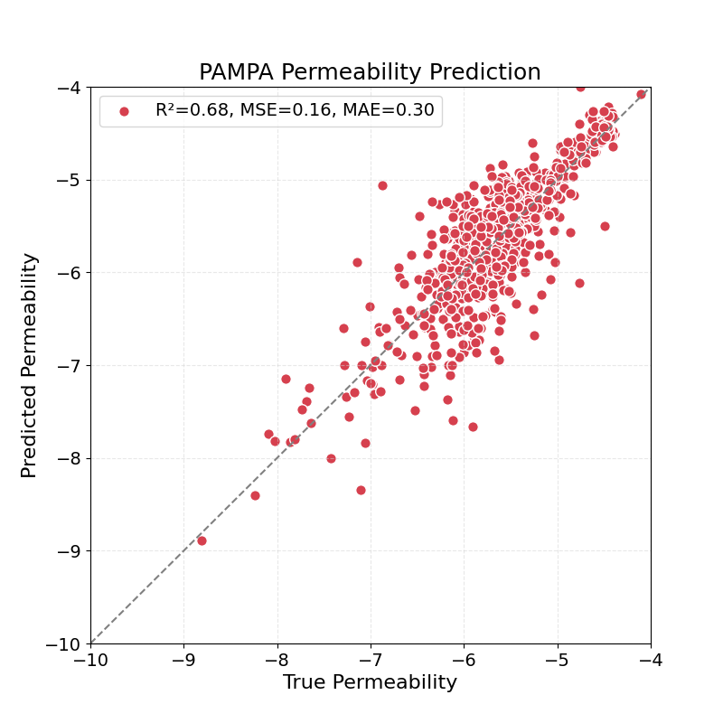
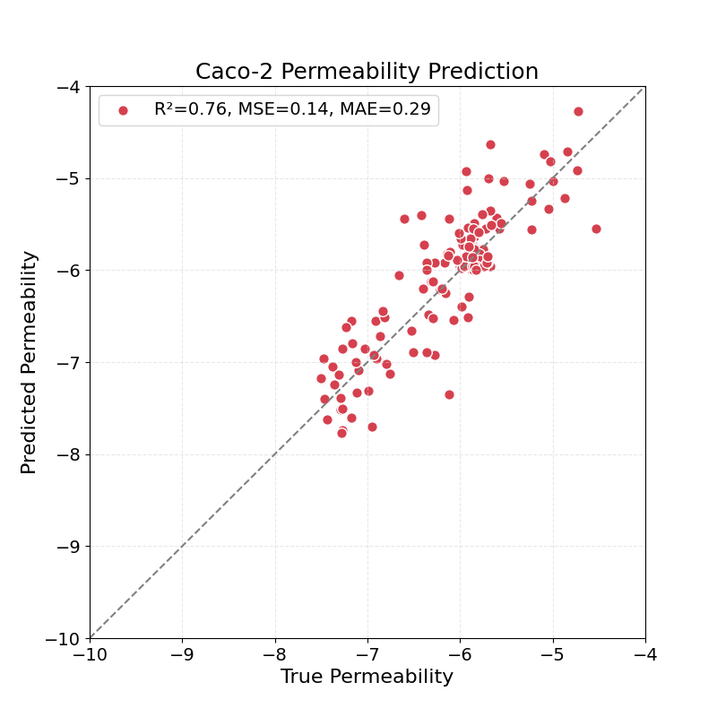
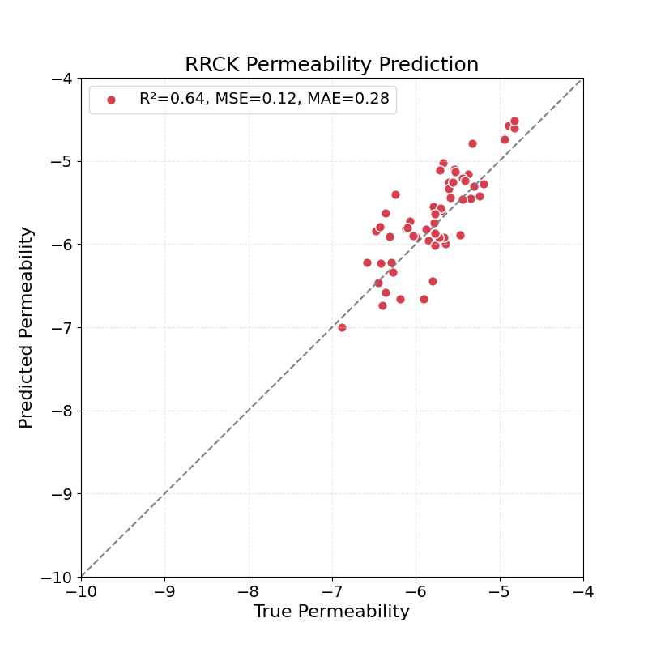
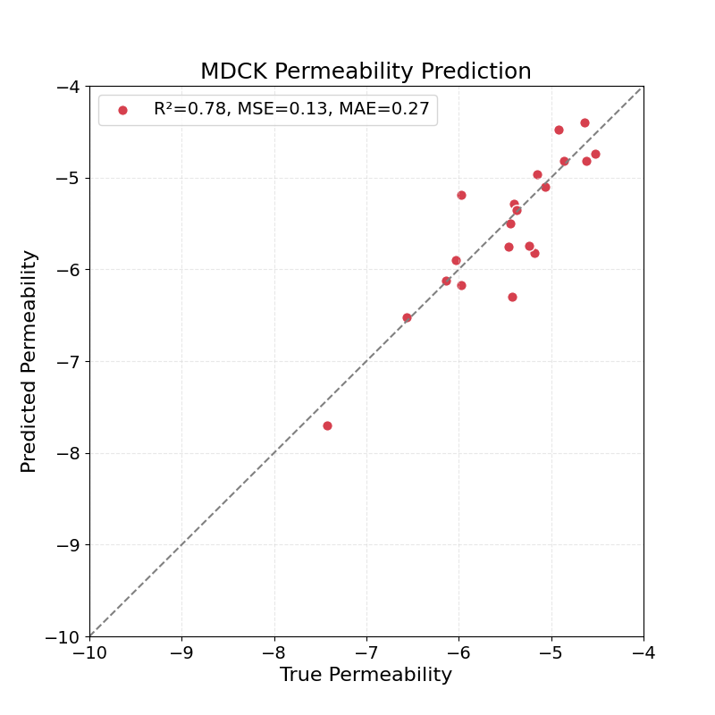

# CPMP: Cyclic Peptide Membrane Permeability Prediction Using Deep Learning Model Based on Molecular Attention Transformer  
## Abstract  
The CPMP model is a deep learning approach for predicting the membrane permeability of cyclic peptides. Built on the Molecular Attention Transformer (MAT) neural network, CPMP achieves high determination coefficients (R²) of 0.67 for PAMPA, 0.75 for Caco-2, 0.62 for RRCK, and 0.73 for MDCK permeability predictions.  

  



## Requirements  
* PyTorch (2.0.1) 
* RDKit (2023.3.2) 
* Scikit-learn (1.3.0) 

## Usage  

### 1. Use the trained model to predict your own data.

```
python predict.py --help
usage: predict.py [-h] [--input_file INPUT_FILE] [--result_file RESULT_FILE]

Predict PAMPA, Caco-2, RRCK and MDCK Membrane Permeability

options:
  -h, --help            show this help message and exit
  --input_file          INPUT_FILE (.csv file)
  --result_file         RESULT_FILE (out file)

```
The input data `input.csv` you need to prepare is as follows:

```
smiles
C/C=C/C[C@@H](C)[C@@H](O)[C@H]1C(=O)N[C@@H](CC)C(=O)N(C)CC(=O)N(C)[C@@H](CC(C)C)C(=O)N[C@@H](C(C)C)C(=O)N(C)[C@@H](CC(C)C)C(=O)N[C@@H](C)C(=O)N[C@H](C)C(=O)N(C)[C@@H](CC(C)C)C(=O)N(C)[C@@H](CC(C)C)C(=O)N(C)[C@@H](C(C)C)C(=O)N1C
CC(C)C[C@@H]1NC(=O)[C@@H](CC(C)C)NC(=O)[C@@H](CC(C)C)NC(=O)[C@H](Cc2ccc(O)cc2)NC(=O)[C@@H]2CCCN2C(=O)[C@@H](CC(C)C)NC1=O
```
You want to save the results to: `predict.csv`
Run:
```
python predict.py --input_file input.csv --result_file predict.csv
```
The obtained results are:
```
smiles,pampa,caco2,rrck,mdck
C/C=C/C[C@@H](C)[C@@H](O)[C@H]1C(=O)N[C@@H](CC)C(=O)N(C)CC(=O)N(C)[C@@H](CC(C)C)C(=O)N[C@@H](C(C)C)C(=O)N(C)[C@@H](CC(C)C)C(=O)N[C@@H](C)C(=O)N[C@H](C)C(=O)N(C)[C@@H](CC(C)C)C(=O)N(C)[C@@H](CC(C)C)C(=O)N(C)[C@@H](C(C)C)C(=O)N1C,-5.85759162902832,-5.69475793838501,-5.773202419281006,-6.25748348236084
CC(C)C[C@@H]1NC(=O)[C@@H](CC(C)C)NC(=O)[C@@H](CC(C)C)NC(=O)[C@H](Cc2ccc(O)cc2)NC(=O)[C@@H]2CCCN2C(=O)[C@@H](CC(C)C)NC1=O,-6.402388572692871,-6.128831386566162,-5.797394752502441,-5.736731052398682
```

### 2. Data in the paper
Before running CPMP on the same data used in the paper, the original data needs to be processed.  
For example, if you want to preprocess the PAMPA data, run:
```
cd data/pampa_uff_ig_true
python process_data.py
```
This takes around five hour on a regular computer.
Alternatively, pre-processed data (~6.2GB) can be found [here](https://zenodo.org/records/14638776). You can directly download and replace the `data` directory.

### 3. Train the CPMP model
For example, if you want to train CPMP model with PAMPA data, run:
```
python train_pampa.py
```

### 4. Use the trained model to predict the test set
For example, if you want to predict  PAMPA test data, run:
```
python predict_pampa.py
```

### 5. Baseline
The implementation scripts for the baseline methods can be found at this path: `baselines/`

## MAT
The CPMP model is built based on the MAT framework. You can find more information about MAT [here](https://github.com/ardigen/MAT).

## License

CPMP is released under an [Apache v2.0 license](LICENSE).

